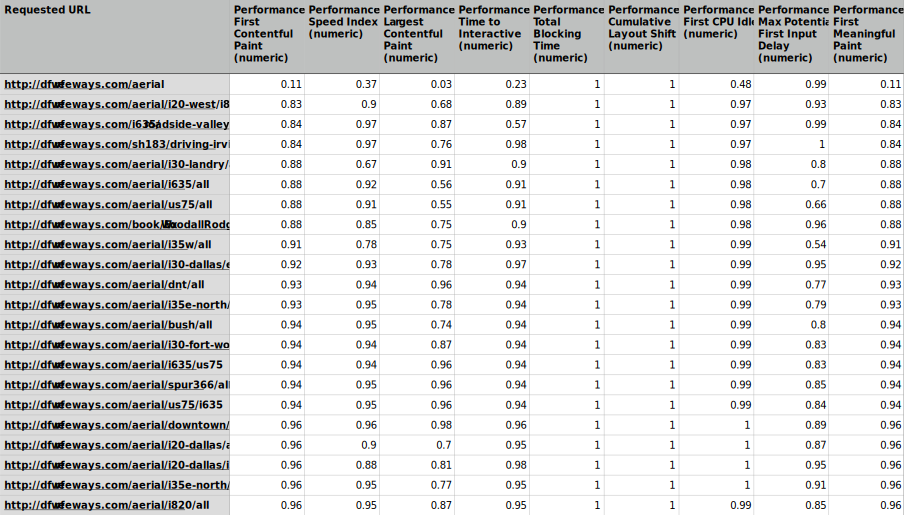

# Site Performance Scanner

A Node.js command line tool that crawls a domain and gathers lighthouse performance data for every page.

## Why?

There are great tools for doing performance analysis on a single web page. We use [Lighthouse](https://developers.google.com/web/tools/lighthouse) and [WebPageTest](https://webpagetest.org/) for this all the time. But what if you want to evaluate the performance characteristics of an entire site? It is tedious to manually run a report for each page and then the output is a jumble of individual reports that have to be analyzed one-by-one. This tool was created to solve this problem. 

With a single command, the tool will crawl an entire site, run a Lighthouse report for each page, and then output a speadsheet with the aggregated data. Each row in the spreadsheet is a page on the site, and each individual performance metric is a column. This makes it very easy to perform high-level analysis because you can sort the rows by any metric. This immediately shows the best and worst pages.

It is also easy to graph data in this format.

## Installation

1. `nvm use`
2. `npm install`

## Usage

### Scan site: crawl + lighthouse + aggregate

`npm run scan -- <URL>`

Ex: `npm run scan -- http://www.dfwfreeways.com/`

Runs a crawler on the provided URL. Discovers all URLs and runs a lighthouse report on each HTML page, then writes them to a CSV file located in `./data/<timestamp>/urls.csv`. The individual reports are written to `./data/<timestamp>/reports/`. At the end, each report file is bundled into one aggregated report CSV with each row representing a URL and each column is a metric. This is a combination of each of the commands below.

### Discover site URLs

`npm run urls -- <URL>`

Ex: `npm run url -- http://www.dfwfreeways.com/`

Runs a crawler on the provided URL. Discovers all URLs and writes them to a CSV file located in `./data/<timestamp>/urls.csv` .
By default, a `robots.txt` file will be ignored, but this flag can be manually changed at the top of `urls_task.js`.

### Generate Lighthouse reports 

`npm run reports -- <path/to/urls.csv>`

Ex: `npm run reports -- data/1595551804243/urls.csv`

Generates a Lighthouse report for each URL in the provided CSV file. Non-HTML content-types will be ignored (Ex: CSS, PNG, JSON...).
The default report format is CSV, but this flag can me manually changed at the top of `lighthouse_task.js`. Each report will be written
to a `reports/` directory in the same directory as the input CSV file.

### Generate Lighthouse reports 

`npm run combine -- <path/to/reports/dir>`

Ex: `npm run combine -- data/1595551804243/reports`

Generates a single spreadsheet with rows for each individual Lighthouse report found in the directory

## Additional docs

The follow links have documentation related to the libraries used by this tool.

* [Lighthouse `lhr` object properties](https://github.com/GoogleChrome/lighthouse/blob/master/docs/understanding-results.md)
* [Using Lighthouse programmatically](https://github.com/GoogleChrome/lighthouse/blob/master/docs/readme.md#using-programmatically)
* [Lighthouse CLI options](https://github.com/GoogleChrome/lighthouse#using-the-node-cli)
* [Lighthouse applies network throttling by defualt...](https://github.com/GoogleChrome/lighthouse#how-does-lighthouse-use-network-throttling-and-how-can-i-make-it-better)
* [Chrome flags/switches](https://peter.sh/experiments/chromium-command-line-switches/)
* [Node CSV docs](https://csv.js.org/)

