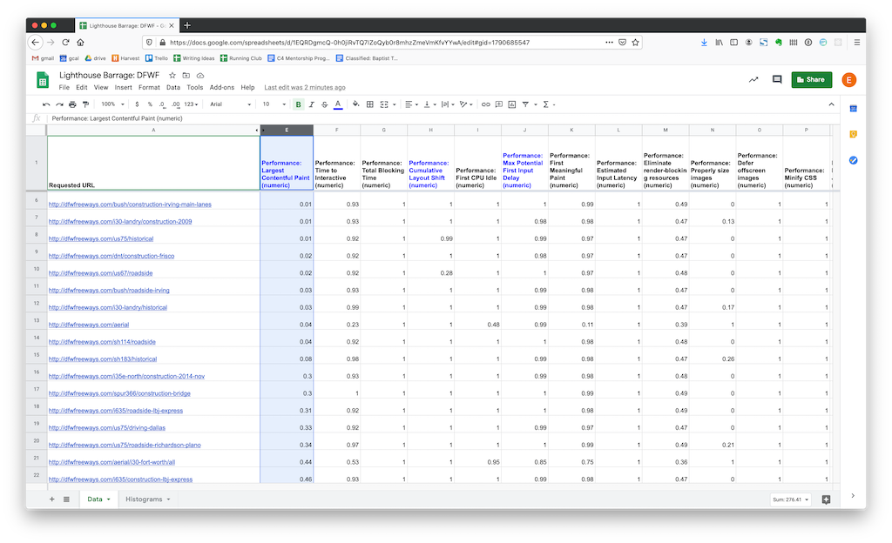
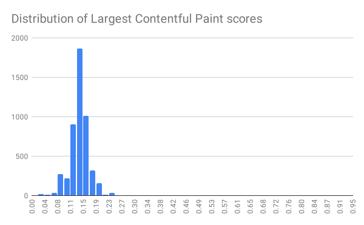

# Lighthouse Parade [](https://github.com/cloudfour/lighthouse-parade/actions?query=workflow%3ACI) [](https://www.npmjs.com/package/lighthouse-parade)

A Node.js command line tool that crawls a domain and compiles a report with lighthouse performance data for every page.

## Why?

There are great tools for doing performance analysis on a single web page. We use [Lighthouse](https://developers.google.com/web/tools/lighthouse) and [WebPageTest](https://webpagetest.org/) for this all the time. But what if you want to evaluate the performance characteristics of an entire site? It is tedious to manually run a report for each page and then the output is a jumble of individual reports that have to be analyzed one-by-one. This tool was created to solve this problem.

## How?

With a single command, the tool will crawl an entire site, run a Lighthouse report for each page, and then output a spreadsheet with the aggregated data. There is an [example of the generated spreadsheet](./examples/exampleAggregatedMobileReport.csv) in the `examples/` directory of this project. Each row in the spreadsheet is a page on the site, and each individual performance metric is a column. This makes it very easy to perform high-level analysis because you can sort the rows by whichever metric you are analyzing. This immediately shows the best and worst performing pages. In the following example, the rows are sorted by first contentful paint.



It is also easy to graph data in this format. The following example is a histogram showing a problematic distribution of largest contentful paint scores.



## Usage

(Check to make sure you are using Node 14+)

```
$ npx lighthouse-parade <url> [dataDirectory] [options]
```

Ex: `npx lighthouse-parade http://www.dfwfreeways.com/`

Runs a crawler on the provided URL. Discovers all URLs and runs a lighthouse report on each HTML page, then writes them to a CSV file located in `./lighthouse-parade-data/<timestamp>/urls.csv`. The individual reports are written to `./lighthouse-parade-data/<timestamp>/reports/`. At the end, each report file is bundled into one aggregated report CSV with each row representing a URL and each column is a metric.

### Options

```
--ignore-robots             Crawl pages even if they are listed in the site's robots.txt  (default false)
--crawler-user-agent        Pass a user agent string to be used by the crawler (not by Lighthouse)
--lighthouse-concurrency    Control the maximum number of ligthhouse reports to run concurrently  (default number of CPU cores minus one)
--max-crawl-depth           Control the maximum depth of crawled links. 1 means only the entry page will be used. 2 means the entry page and any page linked directly from the entry page will be used.
--include-path-glob         Specify a glob (in quotes) for paths to match. Links to non-matched paths will not be crawled. The entry page will be crawled regardless of this flag. This flag can be specified multiple times to allow multiple paths. `*` matches one url segment, `**` matches multiple segments. Trailing slashes are ignored.
--exclude-path-glob         Specify a glob (in quotes) for paths to exclude. Links to matched paths will not be crawled. The entry page will be crawled regardless of this flag. This flag can be specified multiple times to exclude multiple paths. `*` matches one url segment, `**` matches multiple segments. Trailing slashes are ignored.
-v, --version               Displays current version
-h, --help                  Displays help text
```

## Analysis spreadsheet template

After running a scan, you can import your aggregated report data into this [Google Sheet template](https://docs.google.com/spreadsheets/d/1EaxdaYncpWqou5pmi8GN7dMJRwC-oy0s2Z03LvAsHF4), which includes the following features:

- Basic formatting
- The three [web core vitals](https://web.dev/vitals/) columns are highlighted
- Histograms for each web core vital metrics are automatically generated
- Averages and median scores for the web core vitals are also calculated next to each histogram

### Instructions

To use this template, it is important to follow these instructions very carefully when importing:

1. Visit the template and choose File > Make a copy. You will now have your own writable copy.
1. Click cell A:1 in the top left corner.
1. File > Import...
1. In the following dialogue, upload the aggregatedMobileReport.csv file that was generated by the script.
1. **Under Import Location, select Replace data at selected cell**.
1. Click Import Data

## Mac M1 Note

Users running virtualized x64 versions of Node on Macs with M1 chips may see anomalous results. For best results on an M1 chip, ensure you are running the native arm version of Node 16+.

When you run the command `node -p process.arch` you should see `arm64`. If you see `x86`, try uninstalling and reinstalling Node. [More details here](https://gist.github.com/LeZuse/bf838718ff2689c5fc035c5a6825a11c).

## Shout-outs

- [auto-lighthouse](https://github.com/TGiles/auto-lighthouse) is a similar project that provided early inspiration for this one.
- [Lighthouse](https://github.com/GoogleChrome/lighthouse) is handling emulation and performance metrics.
- [Node CSV](https://csv.js.org/) is the library handling CSV logic.
- [simplecrawler](https://github.com/simplecrawler/simplecrawler) is the library handling URL discovery.
